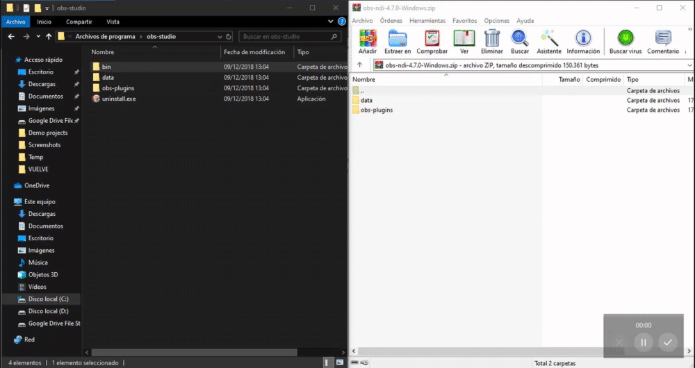
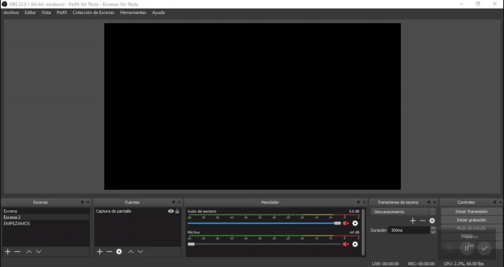

# Cómo instalar y usar Grafana

## Comenzando 🚀 

_Para poder comenzar el primer paso que realizaremos será descargar [OBS Studio](https://obsproject.com/es) en ambos PC, opcionalmente en el PC desde el que vamos a realizar el Stream podemos descargar [OBS Streamlabs](https://streamlabs.com/streamlabs-obs)._

## Instalación 🔧 

_A continuación vamos a ver los pasos que tenemos que seguir para realizar una correcta instalación._

_**Primer paso:** Instalar OBS en ambos PC, como hemos indicado anteriormente_

_**Segundo paso:** Una vez tengamos instalado OBS en ambos PC realizaremos los siguientes pasos dependiendo de si se trata del PC de Stream o el PC de Juego._

_**Tercer paso:** Descargamos el plugin de [NDI para OBS](https://github.com/Palakis/obs-ndi/releases/tag/4.7.0), descargaremos el RUNTIME y el .zip_

_**Cuarto paso:** Movemos el contenido del .zip a la raiz de la instalacion de OBS e instalaremos el RUNTIME._

_**Quinto paso (PC de Juego):** Abirmos OBS, damos permisos al FIREWALL, nos vamos a la pestaña "Herramientas", pinchamos sobre NDI Output Settings, habilitamos "Main OUTPUT" y lo nombramos como nos apetezca, pulsamos en ACEPTAR y añadimos una fuente, por ejemplo, "Captura de Pantalla"._

_**Quinto paso (PC de Stream):** Abirmos OBS, damos permisos al FIREWALL, añadimos una fuente de tipo "NDI Source", se nos abrirá una ventana, donde pone "Source Name" nos aparecerán todos los PC que hemos puesto a retransmitir en el Quinto Paso para el PC de Juego, el resto de opciones NO se tocarán._

**¡RECUERDA!** Para que se vea bien la pantalla en el PC de Stream, tenemos que poner la misma configuracion de video en todos los OBS. En mi caso lo estoy haciendo a 1080p60FPS.

## Autores ✒️

* **Andrés Ruz Nieto** - *Documentación* - [aruznieto](https://github.com/aruznieto) 
* **Rafael García Tristante** - *Documentación* - [TheMrRafus](https://github.com/TheMrRafus) 

## Expresiones de Gratitud 🎁 

* Comenta a otros sobre este proyecto 📢 
* Invita una cerveza 🍺 a alguien del equipo. 
* Da las gracias públicamente 🤓.
* etc.

---
⌨️ con ❤️ por [aruznieto](https://github.com/aruznieto) y [TheMrRafus](https://github.com/TheMrRafus) 😊 
